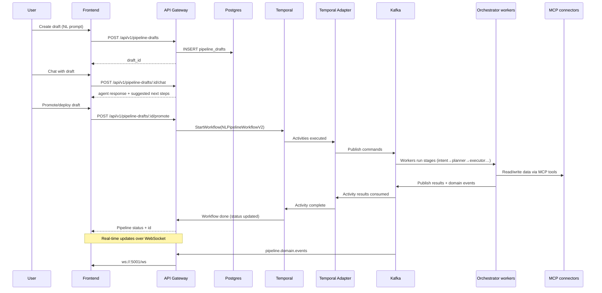

# System Architecture (Current)
**Updated:** 2026-06-25  
**Source of truth:** `docker-compose.yml` + service HLD/LLD in `docs/services/*`

---

## Core idea
rsync-ai is a **Temporal-orchestrated, agentic pipeline engine**. Connectors are **MCP servers** (versioned, dockerized) that workers call to read/write data.

**Canonical UX path**: **Draft-first** (`/chat/draft`) → promote/deploy → Temporal workflow → Kafka workers → MCP connectors.

---

## High-level architecture

```mermaid
graph TB
  subgraph ui [Frontend Layer]
    UI[Next.js UI<br/>:3000]
  end

  subgraph gateway [API Layer]
    GW[API Gateway<br/>:5001]
    WS[WebSocket Hub<br/>ws://:5001/ws]
  end

  subgraph orchestration [Orchestration Layer]
    Temporal[Temporal<br/>:7233]
    Adapter[Temporal Adapter<br/>:8082]
    TUI[Temporal UI<br/>:8233]
  end

  subgraph workers [Worker Layer]
    Orch[Orchestrator<br/>:8081<br/>(9 workers)]
  end

  subgraph ai [AI Layer]
    LLM[LLM Service<br/>(internal)]
    Planner[Planner<br/>:5011]
    ToolGen[Tool Generator<br/>:5010]
    Context7[Context7 MCP<br/>:8087]
  end

  subgraph data [Data Layer]
    PG[(Postgres<br/>:5432)]
    Redis[(Redis<br/>:6379)]
    Kafka[Kafka<br/>:9092]
    KC[Kafka Connect (Debezium)<br/>:8083]
  end

  subgraph mcp [MCP Connectors]
    MySQL[mysql-v1-0-0-mcp]
    S3[aws-s3-v1-0-0-mcp]
    PGc[postgresql-v1-0-0-mcp]
    Sink[kafka-mcp-sink-mcp]
    Debezium[debezium-mcp]
  end

  UI --> GW
  UI --> WS
  GW --> PG
  GW --> Redis
  GW --> Temporal
  GW --> LLM
  Temporal --> Adapter
  Adapter --> Kafka
  Kafka --> Orch
  Orch --> PG
  Orch --> MySQL
  Orch --> S3
  Orch --> PGc
  KC --> Kafka
  Debezium --> KC
  Sink --> Kafka
  WS --> Kafka
  ToolGen --> Context7
  LLM --> Planner
```

---

## Draft-first data flow (canonical)



> **Note — `W->>MCP: Read/write data via MCP tools` is the per-batch *invocation* boundary only.** Sustained bulk does **not** return through the worker over MCP: batch rows ride Kafka with large payloads staged in MinIO (claim-check), and CDC rides Debezium → Kafka → `kafka-mcp-sink` (MCP-free byte stream). The single diagram above collapses both data paths into one hop for readability. See [`ARCHITECTURE.md` §5 → MCP boundary](../../ARCHITECTURE.md) for the authoritative control-plane-vs-transport contract.

---

## Key boundaries (what each service owns)

- **Frontend**: draft-first chat UX, connectors UX, pipeline monitoring.
- **API Gateway**: public REST + WebSocket, auth/user scoping, pipeline/draft CRUD, schedule + HITL endpoints.
- **Temporal**: durable workflows/schedules.
- **Temporal Adapter**: registers workflows/activities and bridges activity execution to Kafka workers.
- **Orchestrator**: worker host (intent/planner/validator/executor/etc), calls MCP connectors, emits domain events.
- **Kafka/Kafka Connect**: control plane (commands/results) + CDC infrastructure (Debezium).
- **MCP connectors**: versioned connector runtime containers exposing tools like `test_connection`, `discover_schema`, `export`, `import` — invoked at the source-export and dest-write boundaries only; bulk batch rides Kafka + MinIO claim-check and CDC rides Debezium → Kafka → sink, **not** MCP (see `ARCHITECTURE.md` §5 → MCP boundary).

---

## Where to read next (canonical)

- **Docs index**: `docs/README.md`
- **API reference**: `docs/api/README.md`
- **Services HLD/LLD**: `docs/services/INDEX.md`
  - `docs/services/api-gateway/*`
  - `docs/services/temporal-adapter/*`
  - `docs/services/orchestrator/*`
  - `docs/services/mcp-connector-runtime/*`


