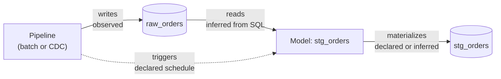

# Data lineage and pipeline observability for self-hosted pipelines

Answer, from the tool you already run your pipelines in: *what ran, what failed, which
tables are downstream of it, and which tables have gone stale?* rsync.ai derives a
table-level lineage graph from what actually ran and what you configured, and records runs,
failures and freshness breaches as it goes. Nothing here needs a separate lineage or
observability product.

**Scope, stated plainly.** Lineage is **table-level**, not column-level. Edges are marked by
how much evidence stands behind them. There is no OpenLineage export documented in this
repository, and this page does not claim one.

## What you can see

| Question | Where it is answered |
|---|---|
| What ran, and how did it end? | **Executions** lists pipeline runs; each run reports stage state, row counts and a trace id. Model runs are on the model's page. |
| Why did a run fail? | The error on the run, plus the [error reference](../errors/README.md), which explains each error code and what to do about it. |
| What is downstream of this table or pipeline? | **Explorer → Lineage** draws one asset's upstream and downstream at a time. A model's own page has a **Graph** tab for the chain around that model. |
| Which tables are stale? | A model's **freshness deadline** records a breach, with a cause, when the table falls further behind than you said it may. |
| What is rebuilding right now? | The **Scheduled Queries** page and the model page show the live state of a rebuild, what is queued behind it and which upstream woke it. |

## How lineage is derived

Nothing is scraped from a warehouse's query log. The graph is computed from three things
rsync.ai already holds: the tables each pipeline run recorded, the SQL of each model, and the
schedules you configured. It writes nothing and triggers nothing.

The four edge kinds do not carry equal weight, and each edge says which it is:

| Edge | Direction | Evidence |
|---|---|---|
| `writes` | pipeline → table | **Observed** — a run actually recorded writing this table. |
| `materializes` | model → table | **Declared** for a `table` model (its target table); **inferred** for a `statement` model (parsed from its SQL). |
| `reads` | table → model | **Inferred** — parsed from the model's SQL. |
| `triggers` | pipeline → model | **Declared** — someone configured this schedule. |

An inferred edge is a suggestion, a declared edge is intent that may never have run, and only
an observed edge is evidence that something happened. The graph keeps those apart instead of
drawing one authoritative-looking "depends on" line.

**Uncovered upstreams.** The most useful number in the graph is not the edge count: it is the
set of producers a model reads from that do *not* cause it to refresh. Each is a model whose
freshness depends on someone remembering to run it. Wiring it to
[an `after_upstream` trigger](scheduled-sql-models-with-dependency-triggers.md) closes the
gap.

## Freshness: noticing what did not happen

Every trigger fires on something happening. A paused schedule, an emptied upstream list or a
rebuild that fails every hour produces no event at all, so nothing notices. A **freshness
deadline** is a timer on the *table*: if the last **succeeded** run is older than the
deadline, a breach is recorded, once per model at a time, with one of five causes
(`no_schedule`, `schedule_paused`, `schedule_auto_paused`, `no_upstreams`, `overdue`). A
model whose rebuild fails every hour therefore does not look fresh — failed runs do not
reset the clock. A breach reports; it never triggers a rebuild.

## Prerequisites

- A running rsync.ai — see the [README install section](../../README.md#install).
- At least one pipeline that has run, so there is something observed to draw.
- For the model-based parts: a database the Explorer supports for models (MySQL/MariaDB,
  PostgreSQL/Redshift, SQL Server). See
  [Scheduled SQL models](scheduled-sql-models-with-dependency-triggers.md#prerequisites).

## What is supported, and what is not

| | |
|---|---|
| Supported | Table-level lineage across pipelines, tables and models; evidence grade on each edge; upstreams that do not trigger a refresh; per-model freshness deadlines and breach history. |
| Not supported | Column-level lineage; lineage from queries run outside rsync.ai; automatic rebuild on a freshness breach; export to an external lineage standard. |
| Not documented here | Graph size limits and refresh timing. No scale figures are published. |

## Verification status

The lineage view, the model Graph tab and the freshness row are recent additions and have
**not been verified against a live run on the current release**. The underlying rules —
which edges are observed, declared or inferred, and how a breach is classified — are
specified in the [design document](../explorer/saved-queries-and-models.md) and covered by
tests in the repository. Treat what you see as a starting point, and check a graph against
what you know your pipelines do before you rely on it.

Related:

- [Scheduled SQL models with dependency triggers](scheduled-sql-models-with-dependency-triggers.md)
- [Data Explorer guide](../explorer/README.md)
- [Self-hosted PostgreSQL CDC pipeline](self-hosted-postgresql-cdc-pipeline.md)
- [All solutions](README.md)
