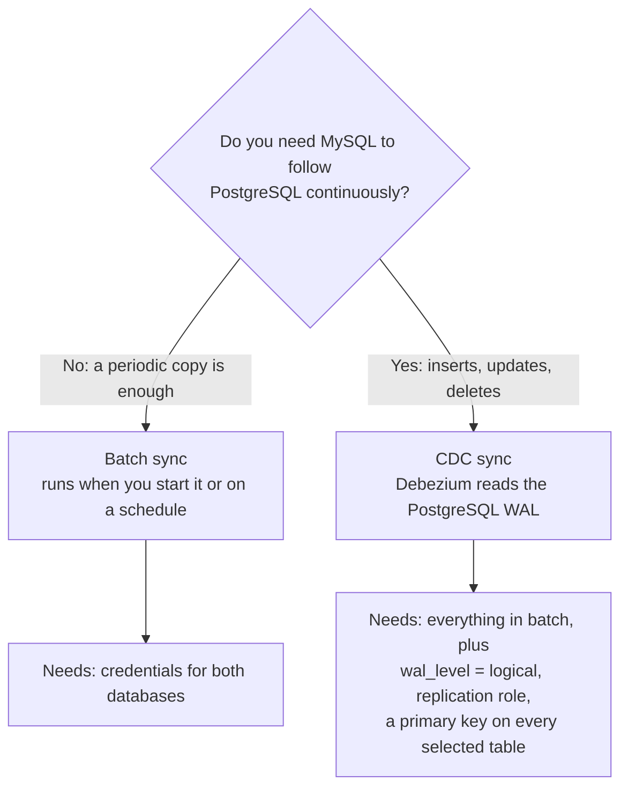

# Self-hosted PostgreSQL to MySQL data sync

Copy tables from PostgreSQL into MySQL on a schedule (batch), or keep MySQL continuously in
step with PostgreSQL by streaming changes (CDC), using a stack you host yourself. Both
databases are shipped connectors, and both can be used as a source and as a destination.

## Pick a mode

| | Batch | CDC |
|---|---|---|
| Source setup | A reachable database and a role that can read the tables. | `wal_level=logical`, `max_replication_slots` and `max_wal_senders` of at least 1, and a role with `REPLICATION`. |
| Source deletes | Not documented as propagated; verify on a test table before relying on it. | Deletes are part of the change stream. |
| Primary key on source tables | Needed when the destination upserts. | **Required for every selected table** when the destination is MySQL or PostgreSQL. |
| Extra components | None beyond the default stack. | Kafka Connect, Debezium and the sink worker — part of the default install. |
| Read more | [Quick start](../getting-started/quickstart.md) | [Self-hosted PostgreSQL CDC pipeline](self-hosted-postgresql-cdc-pipeline.md) |

## Steps

1. **Install rsync.ai** — see the [README install section](../../README.md#install).
2. **Add two connections**: PostgreSQL as the source, MySQL as the destination. Each is
   connection-tested before it is saved, and credentials are stored encrypted with the key
   you hold.
3. **Describe the job** in `/chat`, for example *"sync the `orders` and `customers` tables
   from my PostgreSQL to my MySQL"*, or *"…keep them in sync with CDC"* for streaming.
4. **Choose the tables** at the human-in-the-loop step and confirm the plan. Nothing runs
   until you do.
5. **Read the pre-migration assessment.** Errors block the run and show the fix; warnings
   need your acknowledgement.
6. **Watch the run** stage by stage in the UI.

If you want to see the flow work before pointing it at a real database, the quickstart
stack includes a credential-free `sample-data` source and a throwaway `demo-warehouse`
PostgreSQL —
[Try it in 5 minutes](../getting-started/quickstart.md#try-it-in-5-minutes-with-no-credentials).
That demo is batch, into PostgreSQL; it does not exercise CDC or MySQL.

## What to know before you rely on it

- **Types and DDL.** The connector reference lists source and destination support per
  connector. It does not list, and this page does not claim, a type-by-type mapping between
  PostgreSQL and MySQL. Check a sample table's result in MySQL before trusting a schema you
  did not test.
- **MySQL as a CDC *source* is a different setup** (`binlog_format=ROW`,
  `binlog_row_image=FULL`, replication grants) — see
  [CDC source prerequisites](../connectors/cdc-source-prerequisites.md). This page is about
  PostgreSQL → MySQL.
- **Keyless tables.** CDC into MySQL is refused for a source table without a primary key.
  Add the key at the source; rsync.ai does not invent one for a database destination.
- **No performance claims.** This page publishes no throughput, latency or scale figures,
  because none are measured for this pair.

## Verification status

The PostgreSQL and MySQL connectors are hand-curated and their support flags are checked
against the generated [connector reference](../connectors/reference.md). This repository does
not record an end-to-end PostgreSQL → MySQL run on the current release. Treat your first run
as a test: use a non-production database, compare row counts and a sample of rows, and
read the [CHANGELOG](../../CHANGELOG.md) before upgrading.

Related:

- [Self-hosted PostgreSQL CDC pipeline](self-hosted-postgresql-cdc-pipeline.md)
- [Shopify to PostgreSQL data pipeline](shopify-to-postgresql-data-pipeline.md)
- [All solutions](README.md)
