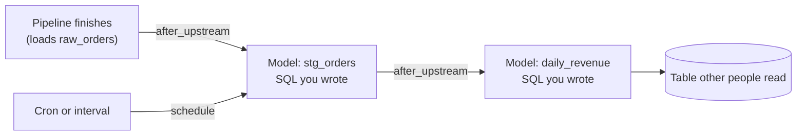

# Scheduled SQL models with dependency triggers

Keep a derived table up to date with SQL you own, without standing up a second scheduler:
save a query in the Data Explorer as a **model**, then rebuild it on a cron, on an interval,
or **after the pipeline or model it reads from finishes**. Approval, version history and
freshness deadlines come with it.

This page is the overview. The full design, including edge cases, is in
[Data Explorer: saved queries, models, and schedules](../explorer/saved-queries-and-models.md).

## How a model rebuilds

A model is a saved SQL query with a *materialization* mode:

| Mode | What it does | Needs a target table |
|---|---|---|
| `none` | A plain bookmark — stored SQL, nothing scheduled. | no |
| `table` | Runs `CREATE TABLE <target> AS <your SQL>` — a full rebuild. | yes |
| `statement` | Runs your SQL exactly as written — for a `MERGE`, `UPDATE` or `INSERT … SELECT` that names its own destination. | no |

There is no `incremental` mode. It is left out on purpose rather than offered before it
behaves as its name says.

## Triggers

| Trigger | Fires when |
|---|---|
| `cron` | A five-field cron expression matches, in a timezone you choose. |
| `interval` | A fixed interval elapses. Ticks align to the Unix epoch, not to when you created the schedule. |
| `after_upstream` | A pipeline or another model it depends on **succeeds**. |

`after_upstream` exists because the alternative — a cron set "a bit after the producer
usually finishes" — is wrong in both directions and reports success when it is early.
A model can name several upstreams and chooses a fan-in policy:

- `any` (default): every upstream success rebuilds the model.
- `all`: rebuild only once every upstream has succeeded since this model's last successful
  rebuild started; otherwise the run is recorded as `skipped` with the reason
  `waiting_on_upstreams`.

Only a **succeeded** run propagates downstream.

## Guardrails

- **Approval gate.** Once a query is scheduled, an edit to its SQL becomes a *proposal*. The
  scheduled run keeps using the approved text until a workspace admin approves the change; a
  plain member can propose but not approve.
- **Version history.** Saved versions can be diffed and restored, subject to the
  retention described in the design document.
- **Freshness deadline.** Optionally say "this table must never be more than N seconds
  behind" (60 seconds to one year). A background check records a breach with a cause —
  `no_schedule`, `schedule_paused`, `schedule_auto_paused`, `no_upstreams` or `overdue` —
  so a schedule that quietly stopped is reported instead of staying silent. A breach only
  reports; it never triggers a rebuild.

## Prerequisites

- A running rsync.ai — see the [README install section](../../README.md#install).
- A connection to a database the Explorer can run models on. **Not every connector can be a
  model**: today that is MySQL/MariaDB, PostgreSQL/Redshift and SQL Server. Databricks,
  BigQuery and ClickHouse can be queried in the Explorer but the materialization control is
  disabled for them, with a reason; MongoDB is not supported in the Explorer at all.
- Data already in that database — for example the result of a
  [batch or CDC pipeline](self-hosted-postgresql-cdc-pipeline.md).

## Steps

1. Open the Data Explorer and connect to the database that holds your data.
2. Write the SQL, or describe it in English and edit the SQL you get back.
3. Open the model dialog: choose `table` or `statement`, and a target table for `table`.
4. Set a trigger — cron, interval, or *after* the upstream pipelines and models it reads.
5. Optionally set a freshness deadline.
6. Read the run history on the model's page; the **Graph** tab shows the chain of upstreams
   and downstreams around it.

## What is supported, and what is not

| | |
|---|---|
| Supported | `table` and `statement` models; cron, interval and after-upstream triggers; `any` and `all` fan-in; approval on edits to scheduled SQL; version history; freshness deadlines. |
| Not supported | Incremental models; rebuilding automatically on a freshness breach; models on Databricks, BigQuery, ClickHouse or MongoDB. |
| Not documented here | Run durations and scale. No benchmark figures are published. |

## Verification status

The behaviour above is specified in the linked design document and covered by tests in the
repository. The model page, Graph tab and freshness row have **not been verified against a
live run on the current release**, so treat them as recent: try a model on non-production data first, and read the
[CHANGELOG](../../CHANGELOG.md) before upgrading.

Related:

- [Data lineage and pipeline observability](data-lineage-and-pipeline-observability.md)
- [Data Explorer guide](../explorer/README.md)
- [Self-hosted PostgreSQL CDC pipeline](self-hosted-postgresql-cdc-pipeline.md)
- [All solutions](README.md)
