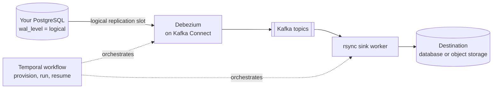

# Self-hosted PostgreSQL change data capture (CDC) pipeline

Stream row-level changes — inserts, updates and deletes — out of a PostgreSQL database
into another system, on infrastructure you host yourself. rsync.ai runs
[Debezium](https://debezium.io/) and Kafka Connect as part of its own stack, provisions the
PostgreSQL publication and replication slot for you in the correct order, and checks the
source before the pipeline starts so a misconfigured database fails early, with a fix you
can copy.

This page covers what the PostgreSQL CDC path needs, what rsync.ai does for you, and where
it stops. It does not cover other CDC sources — MySQL, SQL Server, Oracle and MongoDB have
their own prerequisites in the [connector reference](../connectors/reference.md#cdc-prerequisites).

## How the data moves

Every component in the diagram ships in the default install. Nothing in it is a separate
service you have to sign up for.

## What you need

**On your PostgreSQL server** (checked automatically before the pipeline starts; each failed
check names the fix):

| Requirement | Value | If it is wrong |
|---|---|---|
| `wal_level` | `logical` | Set it and restart the server. On managed PostgreSQL this is a provider parameter (for example `rds.logical_replication` on Amazon RDS, `azure.replication_support` on Azure). |
| `max_replication_slots` | at least 1 (10 recommended) | Raise it and restart. |
| `max_wal_senders` | at least 1 (10 recommended) | Raise it and restart. |
| Connecting role | superuser, or has `REPLICATION` | `ALTER ROLE <user> REPLICATION;` |
| Every selected table | has a `PRIMARY KEY` | See [tables without a primary key](#tables-without-a-primary-key). |

The full check list, with the error code each one raises, is in
[CDC source pre-flight prerequisites](../connectors/cdc-source-prerequisites.md).

**On the machine running rsync.ai:** Docker and the default install, which starts Kafka
Connect, Debezium and the sink worker with everything else — see the
[install section of the README](../../README.md#install) for the command and memory
requirements. The batch-only variant of the install (`RSYNC_PROFILES=`) leaves those
components out, so a CDC pipeline will not run on it.

## What rsync.ai does for you

In this order, every time:

1. **Creates the publication** — `CREATE PUBLICATION … FOR ALL TABLES`.
2. **Sets `REPLICA IDENTITY FULL`** on each table you selected, so an update or delete
   carries the whole row, including large (TOASTed) columns that did not change.
3. **Creates the logical replication slot**, and records the position it returned as the
   start of the stream.
4. **Starts Debezium** with `publication.autocreate.mode` held at `disabled`, so Debezium
   cannot create a publication itself and reverse steps 1 and 3.

The order is fixed on purpose: creating the slot before the publication can lose changes
without any error. The reasoning is in the [connector reference](../connectors/reference.md#cdc-prerequisites).

The pipeline itself is created the same way as any other: describe it in `/chat`
("stream changes from my PostgreSQL `orders` and `customers` tables to …"), approve the
plan, and pick tables at the human-in-the-loop step. Batch and CDC are both first-class; the
step that asks you which tables to include is the same.

## Tables without a primary key

CDC into a **PostgreSQL or MySQL destination** is refused for any selected source table that
has no primary key, with a message listing the tables. Add a key to the source table
yourself — the pre-flight shows the `ALTER TABLE` to run. rsync.ai does not guess a key or
generate a surrogate one for these destinations.

Because the publication is `FOR ALL TABLES`, PostgreSQL also rejects `UPDATE` and `DELETE`
on **any** keyless table in that database once the publication exists, including tables you
did not select. If the database has keyless tables, give them a key before starting.

## What is supported, and what is not

| | |
|---|---|
| Supported | PostgreSQL as a CDC source; inserts, updates and deletes; choosing the tables to include; a run that is a Temporal workflow, so a restarted worker resumes rather than starting over. |
| Destinations | Connectors marked as destinations in the [connector reference](../connectors/reference.md). Which pairs work for CDC is not a table this page can promise: the pre-migration assessment you see before the run is the check. |
| Not supported | CDC from a source outside the five CDC families; CDC into a PostgreSQL or MySQL destination from a table with no primary key (see above). |
| Not documented here | Throughput and latency. No benchmark figures are published for this path, so none are quoted. |

## Verification status

The PostgreSQL provisioning order and the pre-flight checks are covered by automated tests in
the repository, and the connector reference is generated from the connector tree and checked
by CI. An end-to-end run of *your* source and destination on *your* release is the only
evidence that counts for your deployment: run the pipeline against a non-production database
first, and read the [CHANGELOG](../../CHANGELOG.md) before you upgrade.

Related:

- [Self-hosted PostgreSQL to MySQL data sync](postgresql-to-mysql-data-sync.md)
- [Scheduled SQL models with dependency triggers](scheduled-sql-models-with-dependency-triggers.md)
- [Data lineage and pipeline observability](data-lineage-and-pipeline-observability.md)
- [Self-hosting guide](../deployment/self-hosting.md) and [environment variables](../deployment/env-vars.md)
- [All solutions](README.md)
