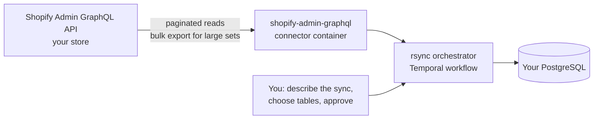

# Self-hosted Shopify to PostgreSQL data pipeline

Load Shopify store data — orders, products, customers, collections, inventory items and
shop settings — into a PostgreSQL database you control, using a Shopify Admin API token and
a self-hosted rsync.ai. The Shopify connector is a batch source: it reads through the Shopify
Admin GraphQL API and does not support CDC.

## How the data moves

## What you need

- **A Shopify Admin API access token** for the store, from a custom app you create in the
  store's admin, with read access to the resources you want to sync. The connector's
  configuration has two required fields — `shop` (the store subdomain, for example `acme`
  for `acme.myshopify.com`) and `access_token` — and an optional API `version` (default
  `2024-10`). OAuth for a Shopify app installed on a shop is also declared by the connector.
- **A PostgreSQL destination** you can write to — your own database, or the throwaway
  `demo-warehouse` from the quickstart stack for a first try.
- **A running rsync.ai** — see the [README install section](../../README.md#install).

## Steps

1. **Add the Shopify connection** with `shop` and `access_token`. The connection is tested
   before it is saved, and the pre-run assessment re-runs the same connection test, so an
   expired token or a missing scope shows up as a `CONNECTOR_AUTH_FAILED` finding before the
   pipeline starts (see
   [source pre-flight](../connectors/source-prerequisites.md)).
2. **Add the PostgreSQL destination connection.**
3. **Describe the job** in `/chat`: *"load my Shopify orders and products into PostgreSQL
   every night"*.
4. **Choose the tables** and confirm the plan.
5. **Watch the run** in the UI and check the resulting tables in PostgreSQL, or in the
   [Data Explorer](../explorer/README.md).

## What is available from Shopify

The connector exposes these read operations (from its metadata,
`shopify-admin-graphql` `v1.0.0`):

| Operation | What it returns |
|---|---|
| `shop` | Shop information and settings |
| `products` | Products, with variants |
| `orders` | Orders |
| `customers` | Customers |
| `collections` | Collections |
| `inventory_items` | Inventory items |
| `export` | A generic GraphQL query dispatcher, for operations you name yourself |

Large exports of products, orders, customers and collections can use Shopify's bulk
operations; the threshold is a connector setting (`SHOPIFY_BULK_OPS_THRESHOLD`, default
10,000) rather than a promise about speed.

## Personal data is not in the default queries

The orders and customers queries **deliberately leave out personally identifying fields**
(order email and phone, customer details, shipping address). Shopify treats those as
protected customer data that a store's app must be approved to read, and requesting them
without approval fails the query. The default queries stay PII-free so that previews and
exports work on every plan. If your app is approved and you need those fields, that is a
change to the connector's query, not a setting — see the
[connector developer guide](../connectors/developer-guide.md).

## What is supported, and what is not

| | |
|---|---|
| Supported | Batch reads of the resources in the table above; loading into PostgreSQL. |
| Not supported | CDC from Shopify (the connector declares no CDC support); real-time change capture. |
| Not documented here | Row-count limits, API rate-limit behaviour and run times for your store. None are quoted, because none are published for this connector. |

## Verification status

The connector, its configuration fields and its operation list are in the repository and
its support flags appear in the generated [connector reference](../connectors/reference.md).
The [source pre-flight](../connectors/source-prerequisites.md#verified-end-to-end-staging-2026-06-03)
record shows the connector's live `test_connection` passing against Shopify on a staging
stack on 2026-06-03; that stack no longer exists, and this repository does not record a
Shopify → PostgreSQL end-to-end run on the current release. Start with a development store.

Related:

- [PostgreSQL to MySQL data sync](postgresql-to-mysql-data-sync.md)
- [Scheduled SQL models with dependency triggers](scheduled-sql-models-with-dependency-triggers.md)
- [Connector reference](../connectors/reference.md)
- [All solutions](README.md)
